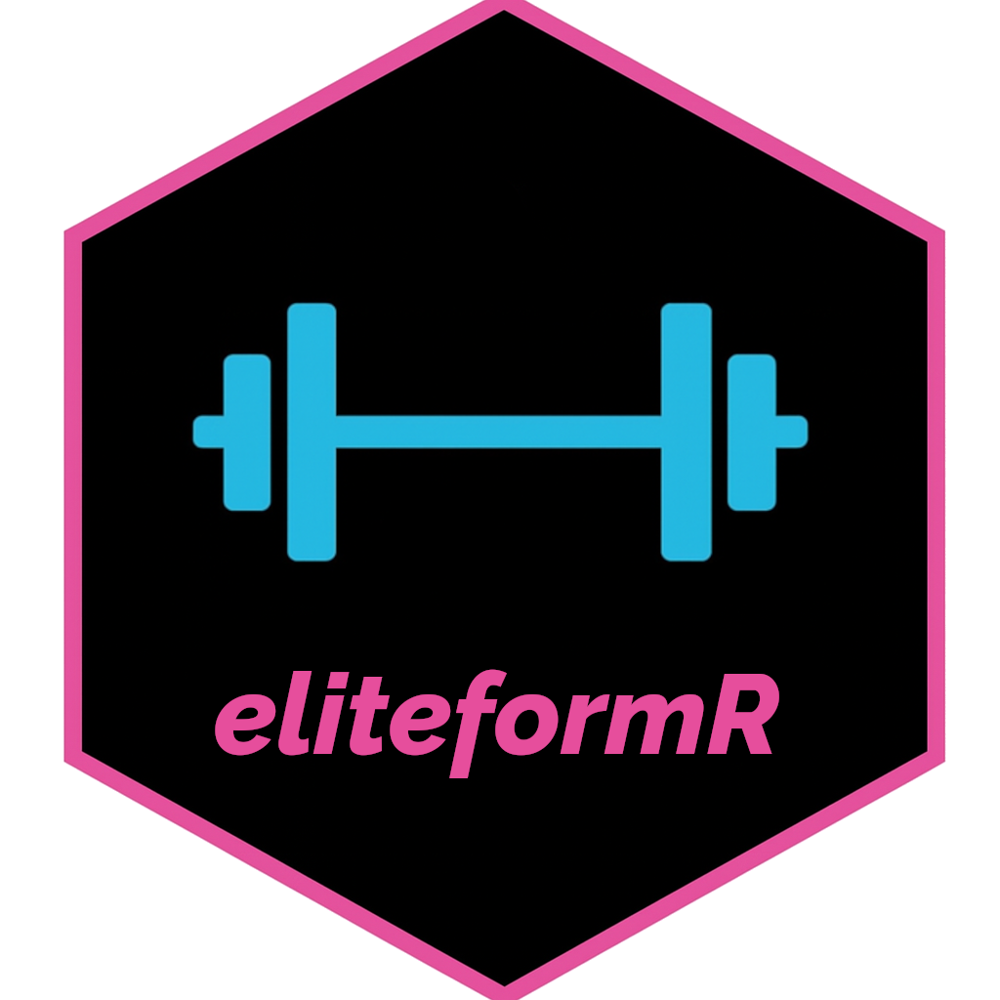

# eliteformR 
**Get your set's and max's from the EliteForm API**   
<!-- badges: start -->
[](https://github.com/MatthewLeeWilcox/eliteformR/actions/workflows/R-CMD-check.yaml)

[](https://choosealicense.com/)
[](https://cran.r-project.org/)
[](https://www.repostatus.org/#active)
[](https://www.tidyverse.org/lifecycle/#stable)
[](commits/master)

<!-- badges: end -->
eliteformR is an R package designed to provide easy interfacing with the [EliteForm](https://www.eliteform.com/) API. An EliteForm account is required to utilize this package.

# Installation
You can install version 1.0.0 of elieteformR from Github with: 
```r
# Install from GitHub
# install.packages("devtools")
devtools::install_github("MatthewLeeWilcox/eliteformR")
```
